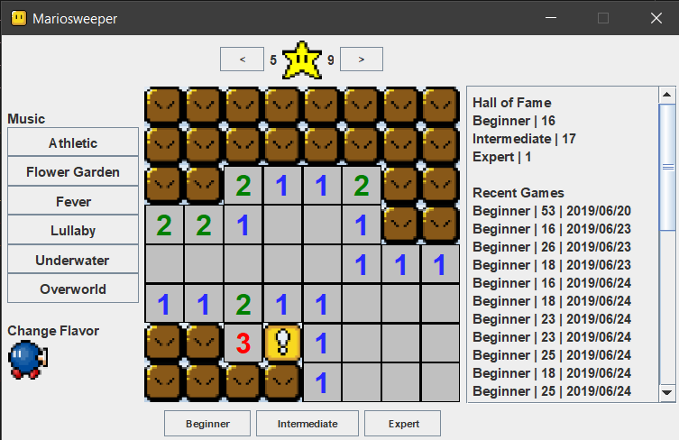

# Mariosweeper
Mario-themed minesweeper clone, written in Java using Swing and AWT.  

## About
This was written for a high school programming course, Programming 12. This was created to mimick the original WINMINE that was released with the Windows Entertainment Pack. However, there are some key gameplay differences between this version and original. 
* The timer starts at 0, not 1.
* Chording (double clicking/middle clicking) does NOT follow your mouse drag.  

## Features
There are a few extra features included.
* Music selection: choose from 6 soundtracks
* Change tile set: change the the mine image
* Detailed high score panel: view your recent games and average times  

## Installation and Usage
Clone the project. To run this project, simply run the jar file located in /dist. If you are on Windows, there is a .exe wrapper as an alternative. To ensure the program runs properly, make sure highscores.sav is in the root directory of the project folder. Alternatively, src/mariosweeper/mariosweeper.java can be opened in NetBeans IDE or Eclipse and run. 

## Legal
This project was for educational purposes only. Images and music are property of Nintendo Co., Ltd. 

